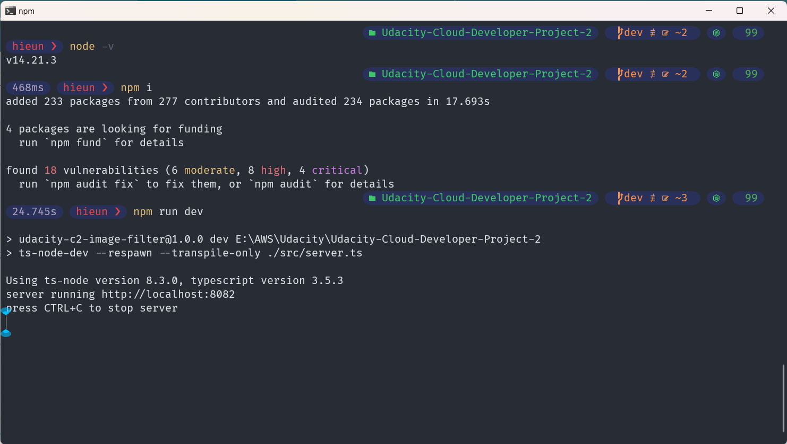
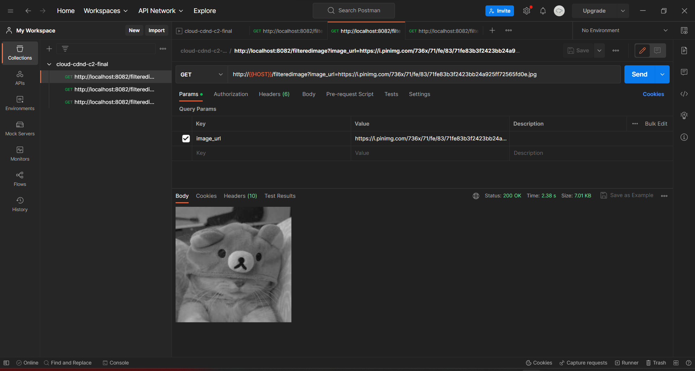
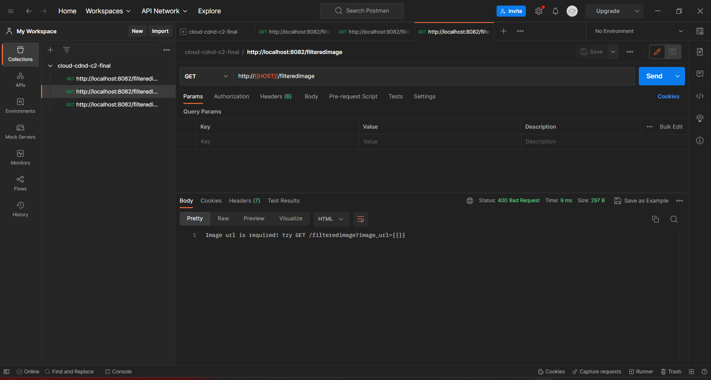
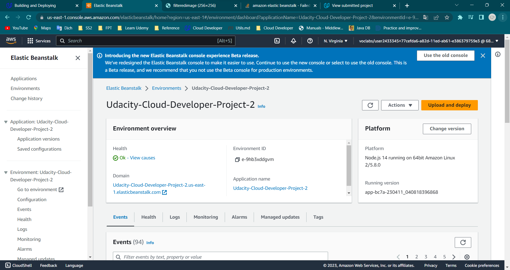

# Udagram Image Filtering

## Github branch

- [master](https://github.com/Iamtinyfish/Udacity-Cloud-Developer-Project-2/tree/dev)
- [dev](https://github.com/Iamtinyfish/Udacity-Cloud-Developer-Project-2/tree/dev)

## Run in local

### 1. Run dev

### 2. Status 200

### 3. Status 400

## Deploy

