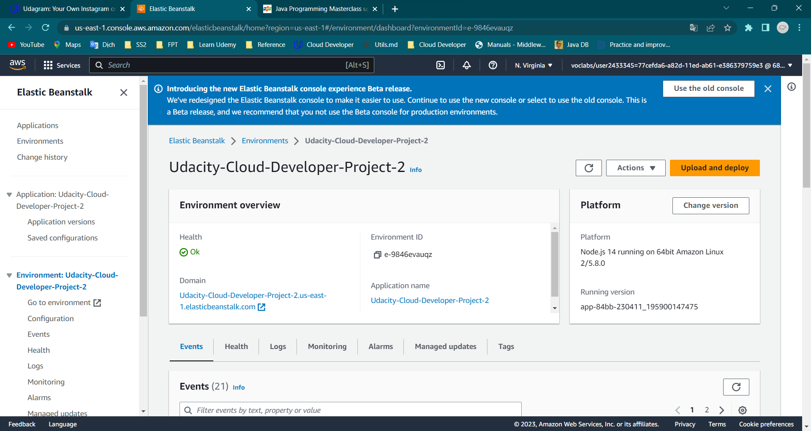

# Udagram Image Filtering

## Link to my Elastic Beanstalk

[http://udacity-cloud-developer-project-2.us-east-1.elasticbeanstalk.com/](http://udacity-cloud-developer-project-2.us-east-1.elasticbeanstalk.com/)

### You can test with links

Status 200: [http://udacity-cloud-developer-project-2.us-east-1.elasticbeanstalk.com/filteredimage?image_url=https://i.pinimg.com/736x/71/fe/83/71fe83b3f2423bb24a925ff72565fd0e.jpg](http://udacity-cloud-developer-project-2.us-east-1.elasticbeanstalk.com/filteredimage?image_url=https://i.pinimg.com/736x/71/fe/83/71fe83b3f2423bb24a925ff72565fd0e.jpg)

Status 400: [http://udacity-cloud-developer-project-2.us-east-1.elasticbeanstalk.com/filteredimage?image_url[]=https://i.pinimg.com/736x/71/fe/83/71fe83b3f2423bb24a925ff72565fd0e.jpg](http://udacity-cloud-developer-project-2.us-east-1.elasticbeanstalk.com/filteredimage?image_url[]=https://i.pinimg.com/736x/71/fe/83/71fe83b3f2423bb24a925ff72565fd0e.jpg)

Status 400: [http://udacity-cloud-developer-project-2.us-east-1.elasticbeanstalk.com/filteredimage](http://udacity-cloud-developer-project-2.us-east-1.elasticbeanstalk.com/)

## Github branch

- [master](https://github.com/Iamtinyfish/Udacity-Cloud-Developer-Project-2/tree/master)
- [dev](https://github.com/Iamtinyfish/Udacity-Cloud-Developer-Project-2/tree/dev)

## Run in local

### 1. Run dev

### 2. Status 200

### 3. Status 400

## Deploy

